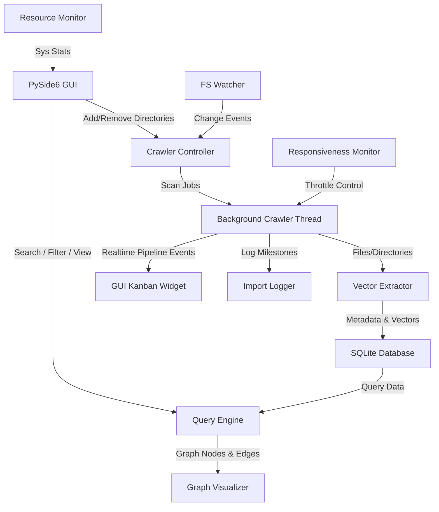

# System Architecture

## High-Level Architecture
The application follows a modular, decoupled architecture consisting of an indexing/vector backend and a rich graphical frontend interface.



### Components
1. **Throttled Crawler Engine**
   - Traverses user directories using standard filesystem APIs in a background thread.
   - Throttled implementation: Introduces micro-sleeps to prevent CPU starvation.
   - Parses `.ignore` files to prune directory traversal early.

2. **Vector Extraction Pipeline**
   - Transforms file metadata, path structure, and content checks into a normalized 42-dimensional vector.

3. **Storage Subsystem**
   - SQLite relational database for storing file paths, metadata properties, and serialized vector blobs.

4. **Similarity Search Engine**
   - Uses NumPy/SciPy for vector distance math.

5. **Graphical User Interface (GUI) & Concurrency**
   - **Framework**: PySide6.
   - **Graph Component**: Embedded HTML5 canvas via `QWebEngineView` using `vis.js` or `d3.js` for force-directed rendering.
   - **Progress & Metrics Dashboard**: Includes the custom **Run-time Kanban Process Board** and status bar widgets for **Nodes, Memory, and Disk**.

---

## HTML5 Graph Component & Force Adjustment (vis.js/D3.js Template)

To prevent node overlap and implement the "Shake" feature in the embedded HTML, use this exact Javascript logic structure inside the `QWebEngineView` canvas code:

```html
<!DOCTYPE html>
<html>
<head>
    <style>
        body, html, #graph { width: 100%; height: 100%; margin: 0; background-color: #11111b; overflow: hidden; }
    </style>
    <!-- Include vis.js library from local asset folder -->
    <script src="vis-network.min.js"></script>
</head>
<body>
    <div id="graph"></div>
    <script>
        let nodes = new vis.DataSet([]);
        let edges = new vis.DataSet([]);
        let container = document.getElementById('graph');
        let data = { nodes: nodes, edges: edges };
        
        // Physics configurations allowing high repulsion to prevent overlap
        let options = {
            interaction: {
                dragView: true,  // Enable mouse drag-panning
                hover: true
            },
            physics: {
                solver: 'forceAtlas2Based',
                forceAtlas2Based: {
                    gravitationalConstant: -50,
                    centralGravity: 0.01,
                    springLength: 100, // Adjustable separation
                    springConstant: 0.08,
                    damping: 0.4,
                    avoidOverlap: 1.0  // Policy: Enforce overlap avoidance
                }
            }
        };
        let network = new vis.Network(container, data, options);

        // Dynamic Physics Freeze for high-density nodes
        network.on("stabilizationIterationsDone", function () {
            if (nodes.length > 1500) {
                network.setOptions({ physics: false });
            }
        });

        // Level of Detail (LoD) Zoom Handler
        network.on("zoom", function (params) {
            let scale = network.getScale();
            let allNodes = nodes.get();
            let updates = [];
            
            allNodes.forEach(node => {
                let updated = false;
                if (scale < 0.4) {
                    // Zoomed far out: hide labels, shrink node size
                    if (node.label !== "") {
                        node.oldLabel = node.label || node.oldLabel;
                        node.label = ""; 
                        node.size = 4;   
                        updated = true;
                    }
                } else {
                    // Zoomed in: restore original labels
                    if (node.label === "" && node.oldLabel) {
                        node.label = node.oldLabel;
                        node.size = undefined; 
                        updated = true;
                    }
                }
                if (updated) {
                    updates.push(node);
                }
            });
            if (updates.length > 0) {
                nodes.update(updates);
            }
        });

        // Keyboard Panning (WASD & Arrow Keys) with Zoom Compensation
        window.addEventListener('keydown', function (event) {
            let baseStep = 40; // Pixels per keypress step
            let scale = network.getScale();
            let stepScaled = baseStep / scale; // Adjust speed depending on zoom depth
            
            let pos = network.getViewPosition();
            let key = event.key.toLowerCase();
            
            if (key === 'w' || key === 'arrowup') {
                network.moveTo({ position: { x: pos.x, y: pos.y - stepScaled } });
                event.preventDefault(); // Prevent default page scrolling
            } else if (key === 's' || key === 'arrowdown') {
                network.moveTo({ position: { x: pos.x, y: pos.y + stepScaled } });
                event.preventDefault();
            } else if (key === 'a' || key === 'arrowleft') {
                network.moveTo({ position: { x: pos.x - stepScaled, y: pos.y } });
                event.preventDefault();
            } else if (key === 'd' || key === 'arrowright') {
                network.moveTo({ position: { x: pos.x + stepScaled, y: pos.y } });
                event.preventDefault();
            }
        });

        // GUI Communication API: Python QWebEngineView calls these functions

        // 1. Separate More (Global Spacing Multiplier)
        function setSeparateMore(multiplier) {
            // Base values: gravitationalConstant = -50, springLength = 100
            let repulsion = -50 * multiplier;
            let springLength = 100 * multiplier;
            network.setOptions({
                physics: {
                    forceAtlas2Based: {
                        gravitationalConstant: repulsion,
                        springLength: springLength
                    }
                }
            });
        }

        // 2. Separate Near (Local Proximity Overlap Multiplier)
        function setSeparateNear(multiplier) {
            // Dynamically scale the label margins to increase proximity bounds
            let allNodes = nodes.get();
            allNodes.forEach(node => {
                node.margin = {
                    top: 10 * multiplier,
                    bottom: 10 * multiplier,
                    left: 15 * multiplier,
                    right: 15 * multiplier
                };
            });
            nodes.update(allNodes);
            
            // Adjust avoidOverlap setting dynamically
            let avoidVal = multiplier > 1.2 ? 1.0 : 0.5;
            network.setOptions({
                physics: {
                    forceAtlas2Based: {
                        avoidOverlap: avoidVal
                    }
                }
            });
        }

        // 3. Shake All Nodes (Global Jitter)
        function shakeAllNodes() {
            let allNodes = nodes.get();
            allNodes.forEach(node => {
                // Apply randomized delta (-100px to 100px)
                node.x = (node.x || 0) + (Math.random() - 0.5) * 200;
                node.y = (node.y || 0) + (Math.random() - 0.5) * 200;
            });
            nodes.update(allNodes);
            network.stabilize(50); // Resolve overlap
        }

        // 4. Shake Selected Cluster (Neighborhood Jitter)
        function shakeCluster(selectedNodeId) {
            if (!selectedNodeId) return;
            // Retrieve topological neighbors up to 2 hops
            let firstHop = network.getConnectedNodes(selectedNodeId);
            let neighbors = new Set([selectedNodeId, ...firstHop]);
            firstHop.forEach(nId => {
                network.getConnectedNodes(nId).forEach(nnId => neighbors.add(nnId));
            });

            let updates = [];
            neighbors.forEach(id => {
                let node = nodes.get(id);
                if (node) {
                    node.x = (node.x || 0) + (Math.random() - 0.5) * 100;
                    node.y = (node.y || 0) + (Math.random() - 0.5) * 100;
                    updates.push(node);
                }
            });
            nodes.update(updates);
            network.stabilize(30);
        }

        // 5. Shake Overlapping Nodes (Proximity Jitter)
        function shakeOverlappingNodes() {
            let positions = network.getPositions();
            let allNodes = nodes.get();
            let updates = [];
            let overlapLimit = 120; // Pixel threshold for proximity check

            for (let i = 0; i < allNodes.length; i++) {
                let nodeA = allNodes[i];
                let posA = positions[nodeA.id];
                if (!posA) continue;

                for (let j = i + 1; j < allNodes.length; j++) {
                    let nodeB = allNodes[j];
                    let posB = positions[nodeB.id];
                    if (!posB) continue;

                    let dx = posA.x - posB.x;
                    let dy = posA.y - posB.y;
                    let distance = Math.sqrt(dx * dx + dy * dy);

                    // If nodes are too near (unreadable), apply jitter
                    if (distance < overlapLimit) {
                        nodeA.x = posA.x + (Math.random() - 0.5) * 60;
                        nodeA.y = posA.y + (Math.random() - 0.5) * 60;
                        nodeB.x = posB.x + (Math.random() - 0.5) * 60;
                        nodeB.y = posB.y + (Math.random() - 0.5) * 60;

                        if (!updates.some(n => n.id === nodeA.id)) updates.push(nodeA);
                        if (!updates.some(n => n.id === nodeB.id)) updates.push(nodeB);
                    }
                }
            }
            if (updates.length > 0) {
                nodes.update(updates);
                network.stabilize(40);
            }
        }
    </script>
</body>
</html>
```

---

## Import Logger & Crash Detector (Concrete Code Skeleton)
- Writes progress details to `import_progress.log`.
- Clears log on startup, writes datetime header on every new import run.

---

## System Resource Monitor Component (Concrete Code Skeleton)
- Periodically checks RAM (MB) and Disk Usage percentage, emitting stats to PySide6.
