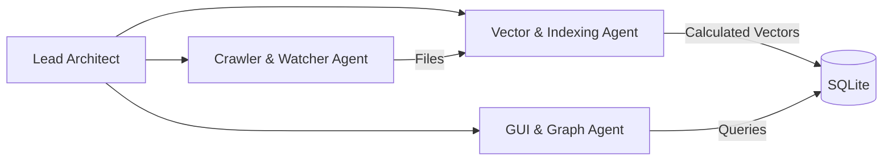

# Agent Developer Team

To successfully build this high-performance application, development is orchestrated among specialized AI agents.

## Developer Agents & Roles

### 1. Lead Architect Agent
- **Responsibilities**:
  - Reviews high-level APIs and structures.
  - Ensures schema consistency across database models.
  - Manages message passing and interfaces between subagents.

### 2. Crawler & Watcher Agent (Backend)
- **Responsibilities**:
  - Implements the fast filesystem scanner.
  - Adds pattern parsing for `.ignore` configurations.
  - Implements the real-time file watcher (using `watchdog` or platform-specific polling/event queues) to keep database indices updated.
  - Configures thread yields and micro-sleeps to keep CPU utilization low (preventing notebook slowdown) as defined in [05_DEVELOPMENT_POLICY.MD](file:///C:/dev3/file_search69/_DESIGN_/05_DEVELOPMENT_POLICY.MD).

### 3. Vector & Indexing Agent (Data Math)
- **Responsibilities**:
  - Implements the normalization mapping functions for the 42 dimensions defined in [04_SCHEMA.MD](file:///C:/dev3/file_search69/_DESIGN_/04_SCHEMA.MD).
  - Implements distance calculation math using NumPy (Euclidean and Cosine distance).
  - Builds in-memory KD-Tree structures to ensure vector search completes in <5 milliseconds.

### 4. GUI & Graph Agent (Frontend)
- **Responsibilities**:
  - Implements the PySide6 user interface.
  - Integrates the embedded WebEngine graph viewer (using `vis.js` or `d3.js`) to provide an Obsidian-like experience.
  - Handles the dual-view switch (View 1: Physical hierarchy + Similarity; View 2: Pure Vector Similarity).
  - Adds controls to customize the similarity distance filter dynamically.
  - Implements the real-time Kanban import/indexing progress board.
