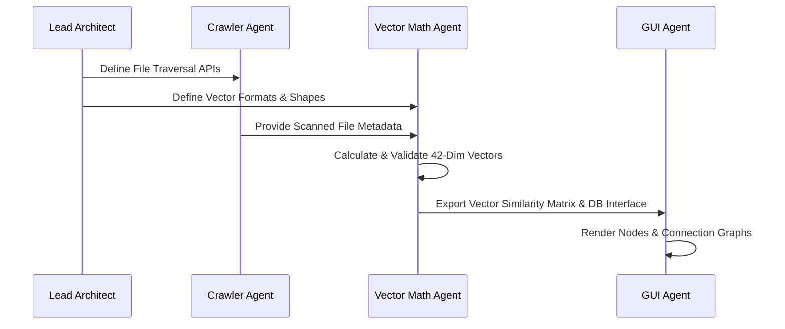

# Agent Team Workflow

This document outlines the operational workflow and coordination processes for the specialized AI developer subagents.

---

## 1. Collaboration Workflow
To build the application systematically and ensure component compatibility, agents must follow this sequential dependency workflow:

### Step 1: Interface Alignment
- Before writing any code, the **Crawler Agent** and the **Vector Math Agent** must agree on the Python dataclass/dictionary schema used to pass file details.

### Step 2: Database Integration
- The **Vector Math Agent** writes embeddings to the SQLite schema defined in [04_SCHEMA.MD](file:///C:/dev3/file_search69/_DESIGN_/04_SCHEMA.MD).
- The **GUI Agent** acts as a consumer of the database, only executing read operations for search and visualization queries.

### Step 3: Graph Physics Layout Throttling
- The **GUI Agent** is prohibited from updating the graph canvas during active crawler indexing. Instead, it must show an indexing status bar and refresh the graph in batches or only upon indexing completion.
