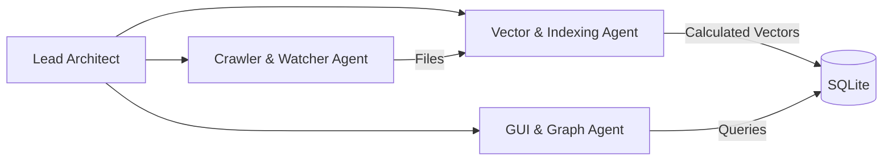

# ทีมเอเจนต์นักพัฒนา (Agent Developer Team)

เพื่อให้การสร้างแอปพลิเคชันประสิทธิภาพสูงประสบความสำเร็จ การพัฒนาจะถูกจัดการและประสานงานโดยทีมพัฒนา AI เฉพาะทางต่างๆ

## เอเจนต์นักพัฒนา & บทบาท (Developer Agents & Roles)

### 1. เอเจนต์สถาปนิกนำ (Lead Architect Agent)
- **ความรับผิดชอบ (Responsibilities)**:
  - ทบทวนโครงสร้างและ API ระดับสูง
  - รับรองความสอดคล้องของสคีมาแบบจำลองของฐานข้อมูล
  - จัดการการส่งผ่านข้อความเชื่อมต่อข้อมูลสื่อสารสำหรับระหว่างเอเจนต์ย่อย

### 2. เอเจนต์รวบรวม & เฝ้าระวังข้อมูล (Crawler & Watcher Agent - Backend)
- **ความรับผิดชอบ (Responsibilities)**:
  - จัดทำตัวสแกนระบบไฟล์ที่รวดเร็ว
  - เพิ่มตัวรับรองรูปแบบไฟล์ใน `.ignore` 
  - สร้างตัวดูแลไฟล์แบบเรียลไทม์ (real-time file watcher) ให้สามารถสอดส่องและเก็บข้อมูลตัวแปรจากแพลตฟอร์มต่างๆ เพื่อช่วยให้ฐานข้อมูลมีความเป็นปัจจุบันเสมอ
  - ปรับใช้การสลับเธรด (thread yields) และ micro-sleeps เพื่อควบคุมการใช้งานของ CPU ให้อยู่ในระดับต่ำ (ป้องกัน Notebook กระตุกหรือค้าง) ตามที่กำหนดใน 05_DEVELOPMENT_POLICY.MD.

### 3. เอเจนต์เวกเตอร์ & ทำดัชนี (Vector & Indexing Agent - Data Math)
- **ความรับผิดชอบ (Responsibilities)**:
  - สร้างฟังก์ชันที่จำเป็นสำหรับการแปลงค่าของคุณสมบัติตามมิติทั้ง 42 ที่ได้ตกลงใน 04_SCHEMA.MD.
  - จัดทำคณิตศาสตร์สำหรับคำนวณหาความเหมือนและระยะห่างโดยใช้ NumPy (Euclidean และ Cosine distance)
  - นำเข้าหลักการโครงสร้างข้อมูลรูปแบบต้นไม้ (KD-Tree structures) ขึ้นในหน่วยความจำ เพื่อให้ข้อมูลการค้นหาสามารถจบกระบวนการให้ได้ภายในเวลาที่น้อยกว่า 5 มิลลิวินาที (<5 milliseconds).

### 4. เอเจนต์ GUI & กราฟ (GUI & Graph Agent - Frontend)
- **ความรับผิดชอบ (Responsibilities)**:
  - สร้างรูปร่างหน้าตาหรืออินเทอร์เฟซจาก PySide6
  - บูรณาการหน้าเครื่องมือกราฟที่ใช้ในการดูจาก WebEngine ที่ฝังอยู่ในแอปพลิเคชัน (ใช้งาน `vis.js` หรือ `d3.js`) เพื่อมอบประสบการณ์การใช้งานเหมือนกับแพลตฟอร์ม Obsidian
  - จัดการสวิตช์สำหรับการแสดงแบบหน้าต่างควบคู่ (มุมมองที่ 1: แสดงตามโครงสร้างความเหมือนเส้นทางจริง; มุมมองที่ 2: แสดงตามลำดับชั้นของเวกเตอร์).
  - นำเสนอตัวควบคุมสำหรับการกำหนดค่าระยะใกล้ (similarity distance filter) ของระบบอย่างยืดหยุ่นและเป็นอิสระ 
  - สร้างบอร์ดสำหรับแสดงขั้นตอนการทำดัชนีแบบ Kanban ขณะประมวลผลข้อมูล (real-time Kanban import/indexing progress board)
