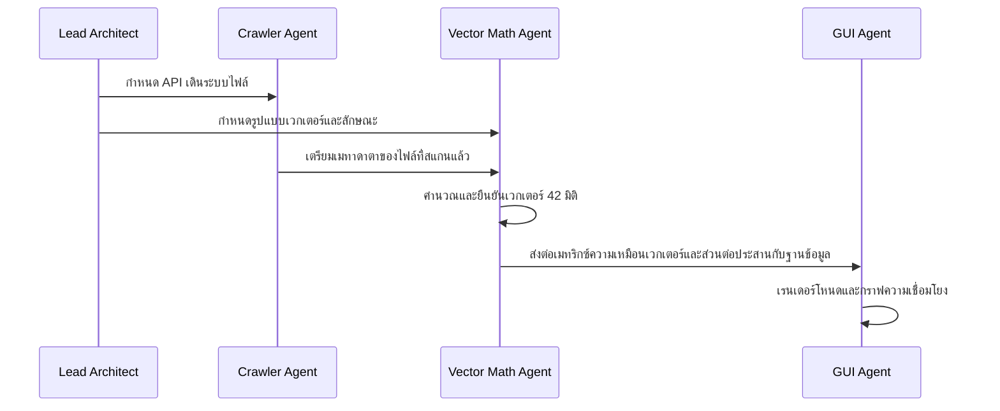

# ขั้นตอนการทำงานของทีมเอเจนต์ (Agent Team Workflow)

เอกสารนี้แสดงโครงร่างของขั้นตอนการดำเนินงาน และกระบวนการประสานงานร่วมกันสำหรับเอเจนต์ย่อยนักพัฒนา AI ที่เชี่ยวชาญเฉพาะด้าน

---

## 1. ขั้นตอนการทำงานร่วมกัน (Collaboration Workflow)
ในการสร้างแอปพลิเคชันอย่างเป็นระบบและรับรองความเข้ากันได้ของแต่ละส่วนประกอบ เหล่าเอเจนต์จะต้องปฏิบัติตามขั้นตอนการพึ่งพาซึ่งกันและกันตามลำดับดังต่อไปนี้:

### ขั้นตอนที่ 1: การจัดการส่วนต่อประสาน (Interface Alignment)
- ก่อนการเขียนโค้ดใดๆ **เอเจนต์ตัวรวบรวมข้อมูล (Crawler Agent)** และ **เอเจนต์คณิตศาสตร์เวกเตอร์ (Vector Math Agent)** ต้องตกลงกันเรื่องรูปแบบคลาสข้อมูล (dataclass)/ดิกชันนารีใน Python ที่จะใช้ส่งข้อมูลรายละเอียดของไฟล์

### ขั้นตอนที่ 2: การบูรณาการกับฐานข้อมูล (Database Integration)
- **เอเจนต์คณิตศาสตร์เวกเตอร์ (Vector Math Agent)** จะเขียนการฝังค่าเวกเตอร์ลงในโครงสร้างสคีมาของ SQLite ตามที่กำหนดไว้ใน 04_SCHEMA.MD.
- **เอเจนต์ GUI (GUI Agent)** รับบทบาทเป็นผู้บริโภคข้อมูล (consumer) ของฐานข้อมูล โดยจะใช้เพียงการอ่านข้อมูลเพื่อตอบสนองการค้นหาและคำถามเพื่อนำมาแสดงผล

### ขั้นตอนที่ 3: ข้อจำกัดชะลอการจัดวางฟิสิกส์กราฟ (Graph Physics Layout Throttling)
- **เอเจนต์ GUI (GUI Agent)** จะถูกห้ามไม่ให้อัปเดตหน้าแคนวาสของกราฟในระหว่างที่ตัวรวบรวมข้อมูลกำลังทำดัชนีอย่างแข็งขัน แต่จะต้องแสดงแถบสถานะการทำดัชนีแทน และเริ่มแสดงกราฟเมื่อทำเป็นรอบๆ (batches) หรือเมื่อการทำดัชนีเสร็จสมบูรณ์แล้วเท่านั้น
